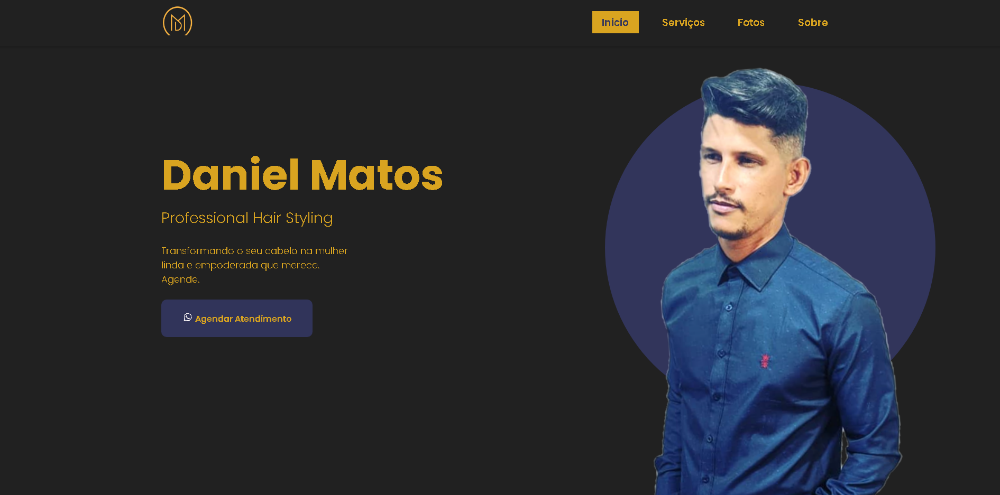

#Projeto Web Site Daniel Matos

##Site pessoal de um profissional cabelereiro

<h1 align="center">
    
</h1>

<h4 align="center">
    🚧 Hmtl | Css3 | Javascript Select 🚀 Em construção... 🚧
</h4>

### 🛠 Tecnologias
- [Html5](________________)
- [CSS3](______________________)
- [Javascript](_______________________)

### Autor
---

 
<b>Michel Matos</b>🚀

Feito com ❤️ por Michel Matos 👋🏽 Entre em contato!

 